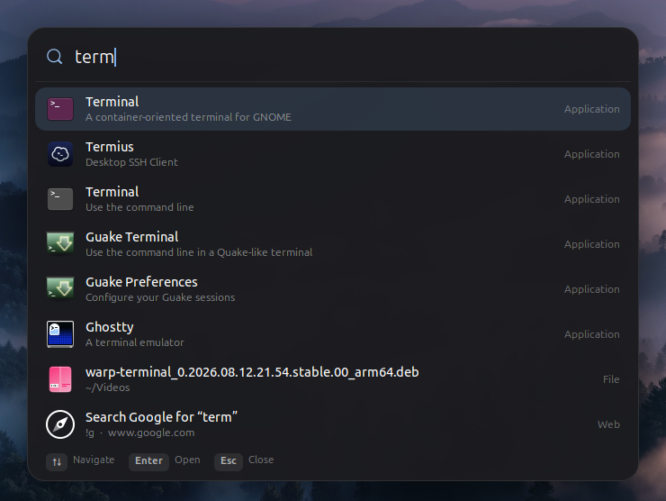
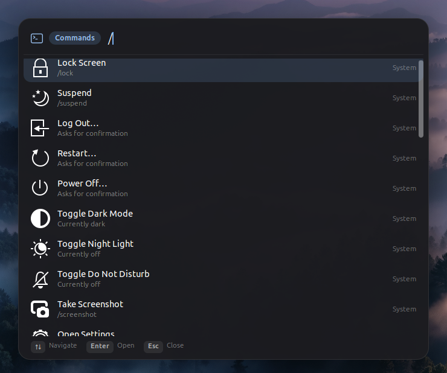
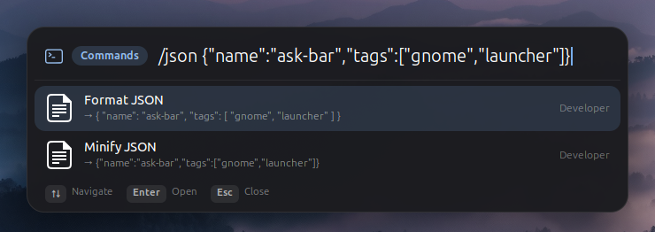
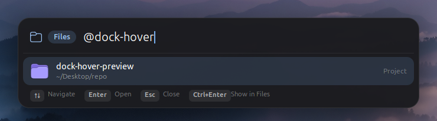
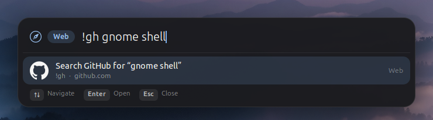
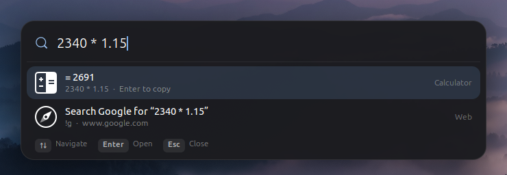

<div align="center">

# Ask Bar

**One shortcut to search everything on GNOME.**

Apps, windows, files, projects, commands, developer tools, math and the web,
from a single bar. Press **Alt+Space** and start typing.

[](LICENSE)
[](https://www.gnome.org)
[](https://github.com/kaleabcodes/ask-bar/actions/workflows/release.yml)



</div>

## Features

- **Apps and windows**: fuzzy search; your most-used apps rank first
- **Files and projects**: GNOME's file index plus your **git repositories**
  (which GNOME doesn't index), with the best matches in every search
- **Commands**: lock, suspend, dark mode, Night Light, Do Not Disturb,
  screenshot, and your own shell commands
- **Developer tools**: format JSON, decode JWTs, Base64 and URL
  encode/decode, timestamps, UUIDs, passwords, hashes, case conversion,
  working on typed text or the clipboard
- **Math**: type `2340 * 1.15` and get the answer
- **Web**: `!gh`, `!yt`, `!so` and other shortcuts, typed URLs, and a web
  search when nothing else matches
- **Ask AI apps**: if Claude or ChatGPT is installed, "Ask Claude" and
  "Ask ChatGPT" appear next to the web search, opening the app with your
  question
- **Keyboard first** and **configurable**: every source, the look and the
  shortcut can be changed in the settings

## Usage

Press **Alt+Space**, type, then press **Enter**.

| Type | To |
| --- | --- |
| *(anything)* | Search apps, windows, files, commands; fall back to the web |
| `@` | Search files and folders (a bare `@` lists recent files) |
| `/` | Run a command or developer tool |
| `=` | Calculate |
| `!` | Search a website: `!gh ask-bar`, `!yt lofi` |
| `?` | Ask an installed AI app (Claude, ChatGPT) |

| Key | Does |
| --- | --- |
| ↑ ↓ | Move the selection |
| Enter | Open or run |
| Ctrl+Enter | Show a file in Files |
| Tab | Complete a web shortcut |
| Esc | Close |

<table>
<tr>
<td></td>
<td><br><br><br></td>
</tr>
</table>

<details>
<summary>All commands</summary>

| Command | Does |
| --- | --- |
| `/lock` `/suspend` `/logout` `/restart` `/shutdown` | Session actions (log out, restart and power off ask for confirmation) |
| `/dark` `/nightlight` `/dnd` | Toggle dark mode, Night Light, Do Not Disturb |
| `/screenshot` `/settings` `/askbar` | Screenshot tool, GNOME Settings, Ask Bar settings |
| `/json` `/jsonmin` | Format or minify JSON |
| `/jwt` | Decode a JWT and show when it expires |
| `/b64` `/b64d` `/url` `/urld` | Base64 and URL encode/decode |
| `/ts` | Unix timestamp ⇄ date (no input: the current time) |
| `/uuid` `/password` | Generate a UUID v4 or a strong password |
| `/sha256` `/sha1` `/md5` | Hash text |
| `/camel` `/snake` `/kebab` `/pascal` `/constant` `/title` `/upper` `/lower` | Change case |
| `/count` | Count characters, words and lines |

Developer tools use the text typed after the command (`/b64 hello`) or, if
nothing is typed, the clipboard. The result is previewed, and Enter copies it.

</details>

<details>
<summary>All web shortcuts</summary>

`!g` Google · `!ddg` DuckDuckGo · `!gh` GitHub · `!yt` YouTube ·
`!so` Stack Overflow · `!w` Wikipedia · `!mdn` MDN · `!npm` npm ·
`!pypi` PyPI · `!maps` Google Maps

Add your own, or replace these, in the settings. Built-in shortcuts show
each site's official logo, from [Simple Icons](https://simpleicons.org)
(CC0); the logos remain trademarks of their owners.

</details>

## Installation

Requires **GNOME Shell 48, 49 or 50**. File search uses `localsearch`,
GNOME's file indexer, which is installed by default on GNOME desktops.

```bash
curl -fsSL https://raw.githubusercontent.com/kaleabcodes/ask-bar/main/install.sh | bash
```

Then **log out and back in**: on Wayland, GNOME loads new extensions at
login. Run the same command again to update.

<details>
<summary>Install from source</summary>

```bash
git clone https://github.com/kaleabcodes/ask-bar.git
cd ask-bar
./install.sh
```

</details>

<details>
<summary>Uninstall</summary>

```bash
curl -fsSL https://raw.githubusercontent.com/kaleabcodes/ask-bar/main/install.sh | bash -s -- --uninstall
```

</details>

> [!NOTE]
> Coming soon to [extensions.gnome.org](https://extensions.gnome.org).

## Configuration

Open **Extensions → Ask Bar → Settings**, type `/askbar` in the bar, or run
`gnome-extensions prefs ask-bar@kaleabcodes.dev`.

| Page | Settings |
| --- | --- |
| **General** | Keyboard shortcut, maximum results, which monitor, remember last search |
| **Search** | Turn apps, windows, calculator, commands, files and the web fallback on or off; how many files; default search engine; recent files; git project scanning |
| **Appearance** | Width, vertical position, compact mode, background dimming, key hints, animations |
| **Shortcuts** | Your own commands (`/name`) and web shortcuts (`!key`) |

## Contributing

Bug reports, ideas and pull requests are welcome. See
[CONTRIBUTING.md](CONTRIBUTING.md).

## License

Released under the [GNU General Public License v2.0 or later](LICENSE).

Made by [Kaleab Tesfaye](https://github.com/kaleabcodes).
